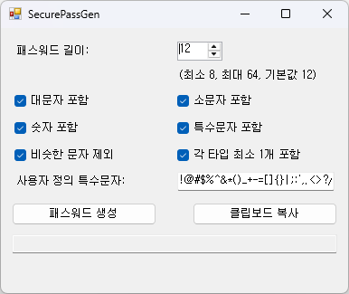

# 🔐 SecurePassGen

**SecurePassGen** is a simple and lightweight password generator that allows you to customize character rules to meet various website requirements.

**SecurePassGen**는 사이트마다 다른 비밀번호 조건을 만족시키기 위해, 사용자가 직접 길이와 문자 구성을 선택할 수 있는 윈도우용 비밀번호 생성기입니다.

---

## ✨ Features | 주요 기능

- Set password length  
  비밀번호 길이 설정 가능 (예: 8~32자)
- Include or exclude character types:  
  포함할 문자 종류를 자유롭게 선택
  - ✅ Uppercase letters (A-Z) | 대문자 포함 여부
  - ✅ Lowercase letters (a-z) | 소문자 포함 여부
  - ✅ Numbers (0-9) | 숫자 포함 여부
  - ✅ Special symbols (!@#$%^&*()_+-=[]{}|;:',.<>?/) | 특수문자 포함 여부
- Exclude similar characters (e.g., l, 1, I, O, 0)  
  헷갈리는 유사 문자 제외 기능
- Copy password to clipboard with one click  
  버튼 클릭 한 번으로 클립보드에 복사
- Simple, intuitive Windows UI  
  직관적이고 깔끔한 윈도우 UI

---

## 🖼 Screenshot | 프로그램 화면

---

## 📦 Download | 다운로드

Visit the [Releases](https://github.com/gr2scoop/SecurePassGen/releases) page to download the latest `.exe` file.  
최신 버전 실행 파일은 [Releases](https://github.com/gr2scoop/SecurePassGen/releases) 탭에서 다운로드할 수 있습니다.

---

## 🛠 Built With | 개발 정보

- **Language**: C#
- **Framework**: .NET Framework (WinForms)

---

## 🚀 Getting Started | 실행 방법

> For developers who want to build or modify this project.  
> 이 프로젝트를 빌드하거나 수정하고 싶은 개발자를 위한 안내입니다.

1. Open the solution in Visual Studio  
   Visual Studio로 솔루션 파일을 엽니다
2. F5 키를 눌러 실행하거나, `bin/Release`에서 `.exe`를 실행하세요

---

## 📄 License | 라이선스

This project is licensed under the [MIT License](LICENSE).  
본 프로젝트는 MIT 라이선스를 따르며, 누구나 자유롭게 사용, 수정, 배포할 수 있습니다.

---

## 🙋 Feedback & Issues | 피드백 및 문의

If you find any issues or have suggestions, feel free to submit them via the [Issues](https://github.com/gr2scoop/SecurePassGen/issues) tab.  
문제점이나 개선 제안이 있다면 [Issues](https://github.com/gr2scoop/SecurePassGen/issues) 탭에 남겨주세요.

---

## 💡 Motivation | 개발 동기

Different websites often require different password rules—some require special characters, others disallow similar-looking characters.  
각 사이트마다 요구하는 비밀번호 조건이 달라서 매번 새로 만들기 번거로웠습니다.

**SecurePassGen** was created to simplify this process and generate strong, compliant passwords quickly.  
**SecurePassGen**는 그 과정을 쉽게 만들고, 사용자가 원하는 조건에 맞는 강력한 비밀번호를 빠르게 생성할 수 있도록 개발되었습니다.
